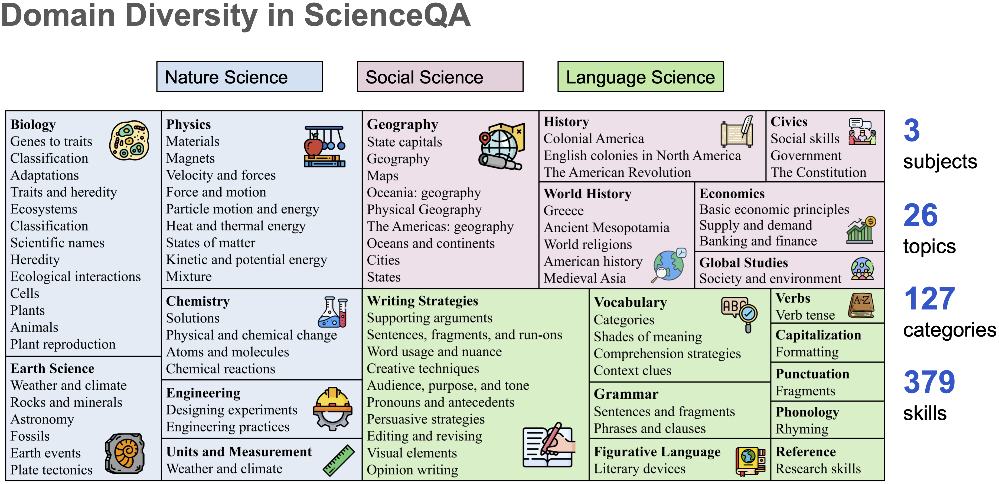
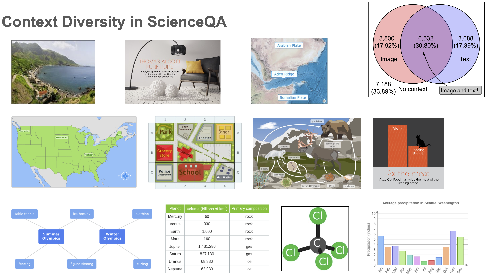
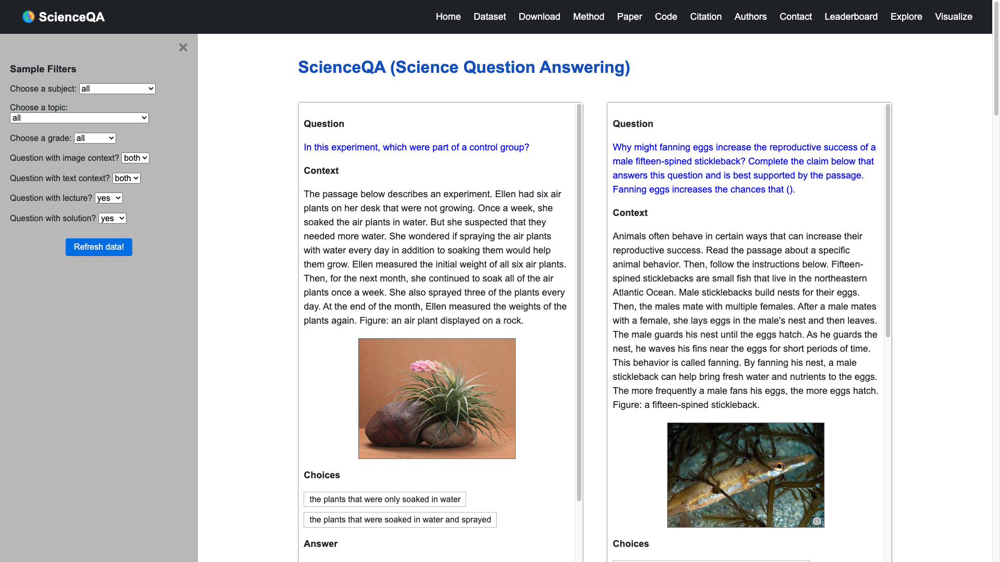
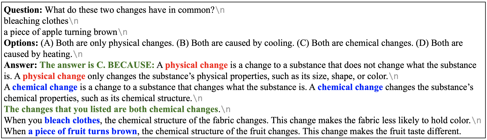

# ScienceQA: Science Question Answering

 
 
 
 
 
 
 
 
 


Data and code for NeurIPS 2022 Paper "[Learn to Explain: Multimodal Reasoning via Thought Chains for Science Question Answering](http://lupantech.github.io/papers/neurips22_scienceqa.pdf)".

For more details, please refer to the project page with dataset exploration and visualization tools: https://scienceqa.github.io.

:bell: If you have any questions or suggestions, please don't hesitate to let us know. You can directly email [Pan Lu](https://lupantech.github.io/) at UCLA using the email address lupantech@gmail.com, comment on the [Twitter](https://twitter.com/lupantech/status/1570828580346802178), or post an issue on this repository.


## 💥 News 💥

- **[2023.12.29]** 🚨 We have a major update featuring over 100 recent models! We appreciate your contributions and feedback. 🚀
- **[2023.05.04]** **ScienceQA** Featured in Leaked Google Document: "[We Have No Moat, And Neither Does OpenAI](https://www.semianalysis.com/p/google-we-have-no-moat-and-neither)": A recent leak of an internal Google document highlights the advancements and impact of **ScienceQA** within the AI research community. 🎯
- **[2023.05.03]** In April, our **ScienceQA** dataset was downloaded **1,421** times from [HuggingFace Datasets](https://huggingface.co/datasets/derek-thomas/ScienceQA), showcasing its growing popularity in the community. [[Link](https://raw.githubusercontent.com/lupantech/ScienceQA/main/assets/huggingface_2023.05.03.png)] 🌟
- **[2023.04.19]** [Chameleon](https://chameleon-llm.github.io/): Developed by UCLA and Microsoft, this innovative project achieves a new SOTA in the few-shot setting, reaching an impressive **86.54%**. :star:
- **[2023.04.17]** [LLaVA](https://llava-vl.github.io/): A collaborative effort by UW–Madison and Microsoft, this groundbreaking work sets a new SOTA at **92.53%**. :star:
- **[2023.04.01]** Our work is accepted by [CVPR 2023 O-DRUM Workshop](https://asu-apg.github.io/odrum/).
- **[2023.04.01]** Our work is covered by [Towards AI](https://towardsai.net/p/machine-learning/chain-of-thought-reasoning-by-c-jarnach-medium?amp=1).
- **[2023.04.01]** Our **ScienceQA** dataset was downloaded **377** times in March at [HuggingFace Datasets](https://huggingface.co/datasets/derek-thomas/ScienceQA).
- **[2023.03.30]** The **ScienceQA** dataset is now included at [OpenDataLab](https://opendatalab.org.cn/ScienceQA).
- **[2023.03.28]** The **ScienceQA** dataset has served as the primary benchmark for [LLaMA-Adapter](https://github.com/ZrrSkywalker/LLaMA-Adapter), developed by Shanghai AI Laboratory, UCLA, and CUHK. :star:
- **[2023.02.13]** Our work gives an oral presentation by Pan Lu at [AAAI 2023 KnowledgeNLP Workshop](https://knowledge-nlp.github.io/aaai2023/publications.html).
- **[2023.02.05]** Our work is covered by [MarkTechPost](https://www.marktechpost.com/2023/02/05/a-new-artificial-intelligence-research-proposes-multimodal-chain-of-thought-reasoning-in-language-models-that-outperforms-gpt-3-5-by-16-75-17-%E2%86%92-91-68-on-scienceqa/).
- **[2023.02.24]** The **ScienceQA** dataset is now included at [HuggingFace Datasets](https://huggingface.co/datasets/derek-thomas/ScienceQA). :star:
- **[2023.02.02]** The **ScienceQA** dataset has served as the primary benchmark for the new generation of multimodal reasoning systems, [Multimodal-CoT](https://github.com/amazon-science/mm-cot), developed by [Amazon Science](https://www.amazon.science/).
- **[2022.11.29]** Our work gives an poster presentation by Pan Lu at [NeurIPS 2022](https://nips.cc/Conferences/2022).
- **[2022.11.20]** Our work is covered by [Geek Culture | Medium](https://medium.com/geekculture/neurips-2022-the-first-multi-modal-science-question-answering-science-qa-dataset-with-detailed-45b8d628b301).
- **[2022.11]** Our work is now included at [Paper with Code](https://paperswithcode.com/dataset/scienceqa).
- **[2022.09.22]** Our work is accepted to [NeurIPS 2022](https://nips.cc/Conferences/2022). 🌟
- **[2022.09.20]** Our work is featured in [Deep AI](https://deepai.org/publication/learn-to-explain-multimodal-reasoning-via-thought-chains-for-science-question-answering).

  

## 🌟 Star History

[](https://star-history.com/#lupantech/ScienceQA&Date)


## :fire: Leaderboard :fire:

Evaluation of different methods on the **test** split (whole: 4,241, mini: 1,000 examples). The accuracies across various categories and the overall average are reported below.

😀 You are invited to contribute your results to the TabMWP test split! Please send your result scores to [this email](mailto:lupantech@gmail.com) or open a new issue at the [github repository](https://github.com/lupantech/PromptPG/issues).

⚠️⚠️⚠️ Caveat: The data in the leaderboard is collected manually from existing papers. There might be some errors in the data, ambiguous data due to different interpretations, and missing data due to the lack of information in the papers. Make sure to double-check the data before using it. Please contact us at [this email](mailto:lupantech@gmail.com) if you find any errors or have any suggestions. We appreciate your contributions and feedback.

The interactive leaderboard is available at https://scienceqa.github.io/leaderboard.html.

| **#** | **Model**                     | **Method** | **Learning** | **#Size** | **#P** |                           **Link**                           | **Date** | **NAT** | **SOC** | **LAN** | **TXT** | **IMG** | **NO** | **G1-6** | **G7-12** |  **Avg**  |
| ----- | ----------------------------- | :--------: | :----------: | :-------: | :----: | :----------------------------------------------------------: | :------: | :-----: | :-----: | :-----: | :-----: | :-----: | :----: | :------: | :-------: | :-------: |
| *     | **Human Performance**         |     -      |      -       |     -     |   -    |           [Link](https://arxiv.org/abs/2209.09513)           | 22-09-20 |  90.23  |  84.97  |  87.48  |  89.60  |  87.50  | 88.10  |  91.59   |   82.42   | **88.40** |
| *     | **Random Chance**             |     -      |      -       |     -     |   -    |           [Link](https://arxiv.org/abs/2209.09513)           | 22-09-20 |  40.28  |  46.13  |  29.25  |  47.45  |  40.08  | 33.66  |  39.35   |   40.67   | **39.83** |
| 1     | **Mutimodal-T-SciQ_Large 🥇**  |    LLM     |  Fine-tune   |   738M    |  738M  |           [Link](https://arxiv.org/abs/2305.03453)           | 23-05-05 |  96.89  |  95.16  |  95.55  |  96.53  |  94.70  | 96.79  |  96.44   |   95.72   | **96.18** |
| 2     | **MC-CoT_F-Large 🥈**          |    VLM     |  Fine-tune   |   783M    |   -    |           [Link](https://arxiv.org/abs/2311.14109)           | 23-11-23 |  97.47  |  90.44  |  93.18  |  96.97  |  93.75  | 94.49  |  95.30   |   94.13   | **94.88** |
| 3     | **Honeybee (Vicuna-13B) 🥉**   |    VLM     |  Fine-tune   |    13B    |   -    |           [Link](https://arxiv.org/abs/2312.06742)           | 23-12-11 |  95.20  |  96.29  |  91.18  |  94.48  |  93.75  | 93.17  |  95.04   |   93.21   | **94.39** |
| 4     | **Enigma-COT_Large**          |    LLM     |  Fine-tune   |   793M    |  793M  |           [Link](https://arxiv.org/abs/2307.12626)           | 23-07-24 |  97.51  |  84.70  |  94.73  |  96.68  |  91.37  | 95.89  |  94.46   |   93.47   | **94.11** |
| 5     | **MC-CoT_Large**              |    VLM     |  Fine-tune   |   738M    |   -    |           [Link](https://arxiv.org/abs/2311.14109)           | 23-11-23 |  95.47  |  89.99  |  91.82  |  95.11  |  92.66  | 93.24  |  94.27   |   91.76   | **93.37** |
| 6     | **DPMM-CoT_Large**            |    VLM     |  Fine-tune   |   738M    |  738M  |           [Link](https://arxiv.org/abs/2312.08762)           | 23-12-14 |  95.52  |  90.33  |  91.36  |  95.50  |  93.26  | 92.68  |  93.28   |   93.47   | **93.35** |
| 7     | **LLaVA (GPT-4 judge)**       |    VLM     |  Fine-tune   |    13B    |  13B   |           [Link](https://arxiv.org/abs/2304.08485)           | 23-04-17 |  91.56  |  96.74  |  91.09  |  90.62  |  88.99  | 93.52  |  92.73   |   92.16   | **92.53** |
| 8     | **CoMD (Vicuna-7B)**          |    VLM     |  Fine-tune   |    7B     |   -    |           [Link](https://arxiv.org/abs/2311.08213)           | 23-11-14 |  91.83  |  95.95  |  88.91  |  90.91  |  89.94  | 91.08  |  92.47   |   90.97   | **91.94** |
| 9     | **Mutimodal-T-SciQ_Base**     |    LLM     |  Fine-tune   |   223M    |  223M  |           [Link](https://arxiv.org/abs/2305.03453)           | 23-05-05 |  91.52  |  91.45  |  92.45  |  91.94  |  90.33  | 92.26  |  92.11   |   91.10   | **91.75** |
| 10    | **Multimodal-CoT_Large**      |    VLM     |  Fine-tune   |   738M    |  738M  |           [Link](https://arxiv.org/abs/2302.00923)           | 23-02-02 |  95.91  |  82.00  |  90.82  |  95.26  |  88.80  | 92.89  |  92.44   |   90.31   | **91.68** |
| 11    | **PILL (LLaMA-7B)**           |    VLM     |  Fine-tune   |    7B     |  45M   |           [Link](https://arxiv.org/abs/2311.02126)           | 23-11-03 |  90.36  |  95.84  |  89.27  |  89.39  |  88.65  | 91.71  |  92.11   |   89.65   | **91.23** |
| 12    | **LLaVA (ViT-L/16-224)**      |    VLM     |  Fine-tune   |    13B    |   -    |           [Link](https://arxiv.org/abs/2312.01987)           | 23-12-04 |    -    |    -    |    -    |    -    |    -    |   -    |    -     |     -     | **91.2**  |
| 13    | **DPMM-CoT_Base**             |    VLM     |  Fine-tune   |   223M    |  223M  |           [Link](https://arxiv.org/abs/2312.08762)           | 23-12-14 |  92.72  |  87.85  |  89.91  |  92.72  |  90.48  | 91.29  |  91.45   |   90.11   | **90.97** |
| 14    | **LLaVA**                     |    VLM     |  Fine-tune   |    13B    |  13B   |           [Link](https://arxiv.org/abs/2304.08485)           | 23-04-17 |  90.36  |  95.95  |  88.00  |  89.49  |  88.00  | 90.66  |  90.93   |   90.90   | **90.92** |
| 15    | **LaVIN-13B**                 |    VLM     |  Fine-tune   |    13B    |  5.4M  |           [Link](https://arxiv.org/abs/2305.15023)           | 23-05-24 |  89.88  |  94.49  |  89.82  |  88.95  |  87.61  | 91.85  |  91.45   |   89.72   | **90.83** |
| 16    | **MC-CoT_F-Base**             |    VLM     |  Fine-tune   |   248M    |   -    |           [Link](https://arxiv.org/abs/2311.14109)           | 23-11-23 |  93.56  |  83.58  |  90.73  |  94.13  |  89.24  | 90.94  |  90.93   |   90.38   | **90.73** |
| 17    | **MC-CoT_Base**               |    VLM     |  Fine-tune   |   223M    |   -    |           [Link](https://arxiv.org/abs/2311.14109)           | 23-11-23 |  91.87  |  84.59  |  93.00  |  92.28  |  88.30  | 92.75  |  90.64   |   90.64   | **90.64** |
| 18    | **LLaMA-SciTune**             |    VLM     |  Zero-shot   |    13B    |   -    |           [Link](https://arxiv.org/abs/2307.01139)           | 23-07-03 |  89.30  |  95.61  |  87.00  |  93.08  |  86.67  | 91.75  |  84.37   |   91.30   | **90.03** |
| 19    | **LaVIN-7B**                  |    VLM     |  Fine-tune   |    7B     |  3.8M  |           [Link](https://arxiv.org/abs/2305.15023)           | 23-05-24 |  89.25  |  94.94  |  85.24  |  88.51  |  87.46  | 88.08  |  90.16   |   88.07   | **89.41** |
| 20    | **Flan-T5-XL (LoRA)**         |    LLM     |  Fine-tune   |     -     |   -    | [Link](https://leejayyoon.github.io/paper/InstructBLIP_PEFT.pdf) | 23-11-03 |    -    |    -    |    -    |    -    |    -    |   -    |    -     |     -     | **89.29** |
| 21    | **Chat-UniVi**                |    VLM     |  Fine-tune   |    7B     |   -    |           [Link](https://arxiv.org/abs/2311.08046)           | 23-11-14 |  88.50  |  93.03  |  85.91  |  88.51  |  85.97  | 88.15  |  88.88   |   88.60   | **88.78** |
| 22    | **DDCoT (T5)**                |    PLM     |  Fine-tune   |   223M    |  223M  |           [Link](https://arxiv.org/abs/2310.16436)           | 23-10-25 |  88.72  |  86.84  |  84.91  |  87.59  |  83.34  | 88.08  |  88.58   |   85.10   | **87.34** |
| 23    | **LG-VQA (CLIP)**             |    VLM     |  Zero-shot   |     -     |   -    |           [Link](https://arxiv.org/abs/2310.20159)           | 23-10-31 |    -    |    -    |    -    |    -    |    -    |   -    |    -     |     -     | **87.22** |
| 24    | **Chameleon (GPT-4)**         |  Tool-LLM  |   Few-shot   |    1T+    |   -    |           [Link](https://arxiv.org/abs/2304.09842)           | 23-04-19 |  89.83  |  74.13  |  89.82  |  88.27  |  77.64  | 92.13  |  88.03   |   83.72   | **86.54** |
| 25    | **LG-VQA (BLIP-2)**           |    VLM     |  Zero-shot   |     -     |   -    |           [Link](https://arxiv.org/abs/2310.20159)           | 23-10-31 |    -    |    -    |    -    |    -    |    -    |   -    |    -     |     -     | **86.32** |
| 26    | **LLaMA-SciTune**             |    VLM     |  Zero-shot   |    7B     |   -    |           [Link](https://arxiv.org/abs/2307.01139)           | 23-07-03 |  84.50  |  94.15  |  82.91  |  88.35  |  83.64  | 88.74  |  85.05   |   85.60   | **86.11** |
| 27    | **Enigma-COT_Base**           |    LLM     |  Fine-tune   |   229M    |  229M  |           [Link](https://arxiv.org/abs/2307.12626)           | 23-07-24 |  88.28  |  78.74  |  85.64  |  88.51  |  84.28  | 86.90  |  85.43   |   85.89   | **85.59** |
| 28    | **LLaMA-Adapter**             |    VLM     |  Fine-tune   |    6B     |  1.2M  |           [Link](https://arxiv.org/abs/2303.16199)           | 23-03-28 |  84.37  |  88.30  |  84.36  |  83.72  |  80.32  | 86.90  |  85.83   |   84.05   | **85.19** |
| 29    | **Multimodal-CoT_Base**       |    VLM     |  Fine-tune   |   223M    |  223M  |           [Link](https://arxiv.org/abs/2302.00923)           | 23-02-02 |  87.52  |  77.17  |  85.82  |  87.88  |  82.90  | 86.83  |  84.65   |   85.37   | **84.91** |
| 30    | **IMMO SL+RL**                |    VLM     |  Fine-tune   |    7B     |   5M   |           [Link](https://arxiv.org/abs/2308.09970)           | 23-08-19 |    -    |    -    |    -    |    -    |    -    |   -    |    -     |     -     | **84.8**  |
| 31    | **CoT GPT-4**                 |    LLM     |   Few-shot   |    1T+    |   -    |           [Link](https://arxiv.org/abs/2304.09842)           | 23-04-19 |  85.48  |  72.44  |  90.27  |  82.65  |  71.49  | 92.89  |  86.66   |   79.04   | **83.99** |
| 32    | **HoT-T5_Large**              |    LLM     |  Fine-tune   |   738M    |  738M  |           [Link](https://arxiv.org/abs/2308.06207)           | 23-08-11 |  84.46  |  79.08  |  84.64  |  82.89  |  75.81  | 88.15  |  83.88   |   82.47   | **83.38** |
| 33    | **HoT-T5_Base**               |    LLM     |  Fine-tune   |   223M    |  223M  |           [Link](https://arxiv.org/abs/2308.06207)           | 23-08-11 |  82.46  |  78.07  |  82.00  |  81.18  |  75.20  | 85.09  |  81.86   |   80.62   | **81.42** |
| 34    | **DDCoT (ChatGPT)**           |    LLM     |  Zero-shot   |   175B    |   -    |           [Link](https://arxiv.org/abs/2310.16436)           | 23-10-25 |  80.15  |  76.72  |  82.82  |  78.89  |  72.53  | 85.02  |  82.86   |   75.21   | **80.15** |
| 35    | **Chameleon (ChatGPT)**       |  Tool-LLM  |   Few-shot   |   175B+   |   -    |           [Link](https://arxiv.org/abs/2304.09842)           | 23-04-19 |  81.62  |  70.64  |  84.00  |  79.77  |  70.80  | 86.62  |  81.86   |   76.53   | **79.93** |
| 36    | **CoT GPT-3 + Doc**           |  Tool-LLM  |  Zero-shot   |   173B    |   -    |           [Link](https://arxiv.org/abs/2308.00675)           | 23-08-01 |    -    |    -    |    -    |    -    |    -    |   -    |    -     |     -     | **79.91** |
| 37    | **UnifiedQA-T-SciQ_Base**     |    LLM     |  Fine-tune   |   223M    |  223M  |           [Link](https://arxiv.org/abs/2305.03453)           | 23-05-05 |  76.56  |  88.99  |  80.45  |  72.90  |  73.84  | 83.47  |  81.09   |   75.19   | **79.41** |
| 38    | **CoT ChatGPT**               |    LLM     |   Few-shot   |   175B    |   -    |           [Link](https://arxiv.org/abs/2304.09842)           | 23-04-19 |  78.82  |  70.98  |  83.18  |  77.37  |  67.92  | 86.13  |  80.72   |   74.03   | **78.31** |
| 39    | **DDCoT (GPT-3)**             |    LLM     |  Zero-shot   |   175B    |   -    |           [Link](https://arxiv.org/abs/2310.16436)           | 23-10-25 |  78.60  |  73.90  |  80.45  |  77.27  |  69.96  | 82.93  |  80.65   |   73.50   | **78.09** |
| 40    | **LaVIN-13B**                 |    VLM     |  Zero-shot   |     -     |   -    |           [Link](https://arxiv.org/abs/2310.09036)           | 23-10-13 |    -    |    -    |    -    |    -    |    -    |   -    |    -     |     -     | **77.54** |
| 41    | **CoT GPT-3 (ALE)**           |    LLM     |   Few-shot   |   173B    |   -    |           [Link](https://arxiv.org/abs/2209.09513)           | 22-09-20 |  75.44  |  70.87  |  78.09  |  74.68  |  67.43  | 79.93  |  78.23   |   69.68   | **75.17** |
| 42    | **LaVIN-7B**                  |    VLM     |  Zero-shot   |     -     |   -    |           [Link](https://arxiv.org/abs/2310.09036)           | 23-10-13 |    -    |    -    |    -    |    -    |    -    |   -    |    -     |     -     | **75.11** |
| 43    | **CoT GPT-3 (AE)**            |    LLM     |   Few-shot   |   173B    |   -    |           [Link](https://arxiv.org/abs/2209.09513)           | 22-09-20 |  76.60  |  65.92  |  77.55  |  75.51  |  66.09  | 79.58  |  78.49   |   67.63   | **74.61** |
| 44    | **BLIP-2**                    |    VLM     |  Zero-shot   |     -     |   -    |           [Link](https://arxiv.org/abs/2310.09036)           | 23-10-13 |    -    |    -    |    -    |    -    |    -    |   -    |    -     |     -     | **74.17** |
| 45    | **CoT UnifiedQA**             |    PLM     |  Fine-tune   |   223M    |  223M  |           [Link](https://arxiv.org/abs/2209.09513)           | 22-09-20 |  71.00  |  76.04  |  78.91  |  66.42  |  66.53  | 81.81  |  77.06   |   68.82   | **74.11** |
| 46    | **GPT-3 (0-shot)**            |    LLM     |  Zero-shot   |   173B    |   -    |           [Link](https://arxiv.org/abs/2209.09513)           | 22-09-20 |  75.04  |  66.59  |  78.00  |  74.24  |  65.74  | 79.58  |  76.36   |   69.87   | **74.04** |
| 47    | **GPT-3 (2-shot)**            |    LLM     |   Few-shot   |   173B    |   -    |           [Link](https://arxiv.org/abs/2209.09513)           | 22-09-20 |  74.64  |  69.74  |  76.00  |  74.44  |  67.28  | 77.42  |  76.80   |   68.89   | **73.97** |
| 48    | **InstructBLIP**              |    VLM     |  Zero-shot   |     -     |   -    |           [Link](https://arxiv.org/abs/2310.09036)           | 23-10-13 |    -    |    -    |    -    |    -    |    -    |   -    |    -     |     -     | **73.33** |
| 49    | **UnifiedQA**                 |    PLM     |  Fine-tune   |   223M    |  223M  |           [Link](https://arxiv.org/abs/2209.09513)           | 22-09-20 |  68.16  |  69.18  |  74.91  |  63.78  |  61.38  | 77.84  |  72.98   |   65.00   | **70.12** |
| 50    | **ChatGPT**                   |    LLM     |  Zero-shot   |     -     |   -    |           [Link](https://arxiv.org/abs/2310.09036)           | 23-10-13 |    -    |    -    |    -    |    -    |    -    |   -    |    -     |     -     | **69.41** |
| 51    | **MetaCLIP**                  |    VLM     |  Zero-shot   |     -     |   -    |           [Link](https://arxiv.org/abs/2312.06709)           | 23-12-10 |    -    |    -    |    -    |    -    |    -    |   -    |    -     |     -     | **68.77** |
| 52    | **OpenCLIP**                  |    VLM     |  Zero-shot   |     -     |   -    |           [Link](https://arxiv.org/abs/2312.06709)           | 23-12-10 |    -    |    -    |    -    |    -    |    -    |   -    |    -     |     -     | **67.53** |
| 53    | **Flan-T5-XXL**               |    LLM     |  Zero-shot   |     -     |   -    |           [Link](https://arxiv.org/abs/2310.09036)           | 23-10-13 |    -    |    -    |    -    |    -    |    -    |   -    |    -     |     -     | **67.43** |
| 54    | **SAM**                       |    VLM     |  Zero-shot   |     -     |   -    |           [Link](https://arxiv.org/abs/2312.06709)           | 23-12-10 |    -    |    -    |    -    |    -    |    -    |   -    |    -     |     -     | **67.08** |
| 55    | **DINOv2**                    |    VLM     |  Zero-shot   |     -     |   -    |           [Link](https://arxiv.org/abs/2312.06709)           | 23-12-10 |    -    |    -    |    -    |    -    |    -    |   -    |    -     |     -     | **64.60** |
| 56    | **VisualBERT**                |    VLM     |  Fine-tune   |   111M    |  111M  |           [Link](https://arxiv.org/abs/2209.09513)           | 22-09-20 |  59.33  |  69.18  |  61.18  |  62.71  |  62.17  | 58.54  |  62.96   |   59.92   | **61.87** |
| 57    | **Patch-TRM**                 |    VLM     |  Fine-tune   |    90M    |  90M   |           [Link](https://arxiv.org/abs/2209.09513)           | 22-09-20 |  65.19  |  46.79  |  65.55  |  66.96  |  55.28  | 64.95  |  58.04   |   67.50   | **61.42** |
| 58    | **ViLT**                      |    VLM     |  Fine-tune   |   113M    |  113M  |           [Link](https://arxiv.org/abs/2209.09513)           | 22-09-20 |  60.48  |  63.89  |  60.27  |  63.20  |  61.38  | 57.00  |  60.72   |   61.90   | **61.14** |
| 59    | **DFAF**                      |   VQA-NN   |  Fine-tune   |    74M    |  74M   |           [Link](https://arxiv.org/abs/2209.09513)           | 22-09-20 |  64.03  |  48.82  |  63.55  |  65.88  |  54.49  | 64.11  |  57.12   |   67.17   | **60.72** |
| 60    | **Chat-UniVi**                |    VLM     |  Zero-shot   |    7B     |   -    |           [Link](https://arxiv.org/abs/2311.08046)           | 23-11-14 |  58.61  |  61.08  |  61.82  |  57.33  |  58.25  | 61.39  |  62.04   |   56.23   | **59.96** |
| 61    | **BAN**                       |   VQA-NN   |  Fine-tune   |   112M    |  112M  |           [Link](https://arxiv.org/abs/2209.09513)           | 22-09-20 |  60.88  |  46.57  |  66.64  |  62.61  |  52.60  | 65.51  |  56.83   |   63.94   | **59.37** |
| 62    | **Top-Down**                  |   VQA-NN   |  Fine-tune   |    70M    |  70M   |           [Link](https://arxiv.org/abs/2209.09513)           | 22-09-20 |  59.50  |  54.33  |  61.82  |  62.90  |  54.88  | 59.79  |  57.27   |   62.16   | **59.02** |
| 63    | **MiniGPT4**                  |    VLM     |  Zero-shot   |     -     |   -    |           [Link](https://arxiv.org/abs/2310.09036)           | 23-10-13 |    -    |    -    |    -    |    -    |    -    |   -    |    -     |     -     | **58.70** |
| 64    | **LLaMA2-13B**                |    LLM     |  Zero-shot   |    13B    |   -    |           [Link](https://arxiv.org/abs/2310.09036)           | 23-10-13 |    -    |    -    |    -    |    -    |    -    |   -    |    -     |     -     | **55.78** |
| 65    | **DDCoT (MiniGPT-4)**         |    VLM     |  Zero-shot   |     -     |   -    |           [Link](https://arxiv.org/abs/2310.16436)           | 23-10-25 |  57.37  |  62.32  |  46.82  |  65.91  |  56.72  | 48.57  |    -     |     -     | **55.67** |
| 66    | **QVix**                      |    VLM     |  Zero-shot   |     -     |   -    |           [Link](https://arxiv.org/abs/2312.01598)           | 23-12-04 |    -    |    -    |    -    |    -    |    -    |   -    |    -     |     -     | **55.0**  |
| 67    | **MCAN**                      |   VQA-NN   |  Fine-tune   |    95M    |  95M   |           [Link](https://arxiv.org/abs/2209.09513)           | 22-09-20 |  56.08  |  46.23  |  58.09  |  59.43  |  51.17  | 55.40  |  51.65   |   59.72   | **54.54** |
| 68    | **LLaMA-Adapter-V2**          |    VLM     |  Zero-shot   |     -     |   -    |           [Link](https://arxiv.org/abs/2310.09036)           | 23-10-13 |    -    |    -    |    -    |    -    |    -    |   -    |    -     |     -     | **54.44** |
| 69    | **VLIS**                      |    VLM     |  Zero-shot   |     -     |   -    |           [Link](https://arxiv.org/abs/2310.09767)           | 23-10-15 |    -    |    -    |    -    |  53.1   |  49.3   |  49.1  |    -     |     -     | **50.2**  |
| 70    | **LLaVA-13B**                 |    VLM     |  Zero-shot   |     -     |   -    |           [Link](https://arxiv.org/abs/2310.09036)           | 23-10-13 |    -    |    -    |    -    |    -    |    -    |   -    |    -     |     -     | **47.74** |
| 71    | **VPGTrans**                  |    VLM     |  Zero-shot   |     -     |   -    |           [Link](https://arxiv.org/abs/2310.09036)           | 23-10-13 |    -    |    -    |    -    |    -    |    -    |   -    |    -     |     -     | **47.00** |
| 72    | **MiniGPT-4**                 |    VLM     |  Zero-shot   |     -     |   -    |           [Link](https://arxiv.org/abs/2310.16436)           | 23-10-25 |  43.83  |  48.59  |  43.36  |  55.01  |  42.84  | 41.67  |    -     |     -     | **44.71** |
| 73    | **LLaMA1-13B**                |    LLM     |  Zero-shot   |    13B    |   -    |           [Link](https://arxiv.org/abs/2310.09036)           | 23-10-13 |    -    |    -    |    -    |    -    |    -    |   -    |    -     |     -     | **43.33** |
| 74    | **LLaMA2-7B**                 |    LLM     |  Zero-shot   |    7B     |   -    |           [Link](https://arxiv.org/abs/2310.09036)           | 23-10-13 |    -    |    -    |    -    |    -    |    -    |   -    |    -     |     -     | **43.08** |
| 75    | **LLaVA-7B**                  |    VLM     |  Zero-shot   |     -     |   -    |           [Link](https://arxiv.org/abs/2310.09036)           | 23-10-13 |    -    |    -    |    -    |    -    |    -    |   -    |    -     |     -     | **41.10** |
| 76    | **OpenFlamingo**              |    VLM     |  Zero-shot   |     -     |   -    |           [Link](https://arxiv.org/abs/2310.09036)           | 23-10-13 |    -    |    -    |    -    |    -    |    -    |   -    |    -     |     -     | **39.27** |
| 77    | **Lynx**                      |    VLM     |  Zero-shot   |     -     |   -    |           [Link](https://arxiv.org/abs/2310.09036)           | 23-10-13 |    -    |    -    |    -    |    -    |    -    |   -    |    -     |     -     | **38.28** |
| 78    | **mPLUG-Owl**                 |    VLM     |  Zero-shot   |     -     |   -    |           [Link](https://arxiv.org/abs/2310.09036)           | 23-10-13 |    -    |    -    |    -    |    -    |    -    |   -    |    -     |     -     | **37.93** |
| 79    | **MultiGPT**                  |    VLM     |  Zero-shot   |     -     |   -    |           [Link](https://arxiv.org/abs/2310.09036)           | 23-10-13 |    -    |    -    |    -    |    -    |    -    |   -    |    -     |     -     | **36.29** |
| 80    | **LLaMA1-7B**                 |    LLM     |  Zero-shot   |    7B     |   -    |           [Link](https://arxiv.org/abs/2310.09036)           | 23-10-13 |    -    |    -    |    -    |    -    |    -    |   -    |    -     |     -     | **36.19** |
| 81    | **Fromage**                   |    VLM     |  Zero-shot   |     -     |   -    |           [Link](https://arxiv.org/abs/2310.09036)           | 23-10-13 |    -    |    -    |    -    |    -    |    -    |   -    |    -     |     -     | **34.51** |
| -     | **MMICL**                     |    VLM     |  Zero-shot   |     -     |   -    |           [Link](https://arxiv.org/abs/2309.07915)           | 23-09-14 |    -    |    -    |    -    |    -    |  82.10  |   -    |    -     |     -     |   **-**   |
| -     | **VILA-13B (Llama-2-13B)**    |    VLM     |      -       |    13B    |   -    |           [Link](https://arxiv.org/abs/2312.07533)           | 23-12-12 |    -    |    -    |    -    |    -    |  73.7   |   -    |    -     |     -     |   **-**   |
| -     | **LLaVA+SIRI**                |    VLM     |      -       |    13B    |   -    |           [Link](https://arxiv.org/abs/2311.17331)           | 23-11-29 |    -    |    -    |    -    |    -    |  72.0   |   -    |    -     |     -     |   **-**   |
| -     | **LLaVA-1.5 (Vicuna-13B)**    |    VLM     |  Zero-shot   |    13B    |   -    |           [Link](https://arxiv.org/abs/2310.03744)           | 23-10-05 |    -    |    -    |    -    |    -    |  71.6   |   -    |    -     |     -     |   **-**   |
| -     | **InstructBLIP**              |    VLM     |  Zero-shot   |     -     |   -    |           [Link](https://arxiv.org/abs/2309.07915)           | 23-09-14 |    -    |    -    |    -    |    -    |  71.30  |   -    |    -     |     -     |   **-**   |
| -     | **ShareGPT4V (Vicuna-7B)**    |    VLM     |      -       |    7B     |   -    |           [Link](https://arxiv.org/abs/2311.12793)           | 23-11-23 |    -    |    -    |    -    |    -    |  68.4   |   -    |    -     |     -     |   **-**   |
| -     | **Qwen-VL-Chat (Qwen-7B)**    |    VLM     |  Zero-shot   |    7B     |   -    |           [Link](https://arxiv.org/abs/2310.03744)           | 23-10-05 |    -    |    -    |    -    |    -    |  68.2   |   -    |    -     |     -     |   **-**   |
| -     | **Multimodal Bard**           |    VLM     |  Zero-shot   |     -     |   -    |           [Link](https://arxiv.org/abs/2308.03729)           | 23-08-07 |    -    |    -    |    -    |    -    |   68    |   -    |    -     |     -     |   **-**   |
| -     | **Qwen-VL (Qwen-7B)**         |    VLM     |  Zero-shot   |    7B     |   -    |           [Link](https://arxiv.org/abs/2310.03744)           | 23-10-05 |    -    |    -    |    -    |    -    |  67.1   |   -    |    -     |     -     |   **-**   |
| -     | **LLaVA-1.5 (Vicuna-7B)**     |    VLM     |  Zero-shot   |    7B     |   -    |           [Link](https://arxiv.org/abs/2310.03744)           | 23-10-05 |    -    |    -    |    -    |    -    |  66.8   |   -    |    -     |     -     |   **-**   |
| -     | **Video-LLaVA (Vicuna-7B)**   |    VLM     |      -       |    7B     |   -    |           [Link](https://arxiv.org/abs/2311.10122)           | 23-11-16 |    -    |    -    |    -    |    -    |  66.4   |   -    |    -     |     -     |   **-**   |
| -     | **InstructBLIP+MoCLE**        |    VLM     |  Zero-shot   |    7B     |   -    |           [Link](https://arxiv.org/abs/2312.12379)           | 23-12-19 |    -    |    -    |    -    |    -    |  63.9   |   -    |    -     |     -     |   **-**   |
| -     | **Otter**                     |    VLM     |  Zero-shot   |     -     |   -    |           [Link](https://arxiv.org/abs/2309.07915)           | 23-09-14 |    -    |    -    |    -    |    -    |  63.10  |   -    |    -     |     -     |   **-**   |
| -     | **InstructBLIP (Vicuna-13B)** |    VLM     |  Zero-shot   |    13B    |   -    |           [Link](https://arxiv.org/abs/2310.03744)           | 23-10-05 |    -    |    -    |    -    |    -    |  63.1   |   -    |    -     |     -     |   **-**   |
| -     | **BLIP-2 (Vicuna-13B)**       |    VLM     |  Zero-shot   |    13B    |   -    |           [Link](https://arxiv.org/abs/2310.03744)           | 23-10-05 |    -    |    -    |    -    |    -    |   61    |   -    |    -     |     -     |   **-**   |
| -     | **InstructBLIP (Vicuna-7B)**  |    VLM     |  Zero-shot   |    7B     |   -    |           [Link](https://arxiv.org/abs/2310.03744)           | 23-10-05 |    -    |    -    |    -    |    -    |  60.5   |   -    |    -     |     -     |   **-**   |
| -     | **Ying-VLM**                  |    VLM     |  Zero-shot   |     -     |   -    |           [Link](https://arxiv.org/abs/2309.07915)           | 23-09-14 |    -    |    -    |    -    |    -    |  55.70  |   -    |    -     |     -     |   **-**   |
| -     | **Shikra**                    |    VLM     |  Zero-shot   |     -     |   -    |           [Link](https://arxiv.org/abs/2309.07915)           | 23-09-14 |    -    |    -    |    -    |    -    |  45.80  |   -    |    -     |     -     |   **-**   |
|       | **CaCo-CoT (Claude)**         |    LLM     |   Few-shot   |     -     |   -    |           [Link](https://arxiv.org/abs/2308.11914)           | 23-08-23 |    -    |    -    |    -    |  90.8   |    -    |   -    |    -     |     -     |   **-**   |
|       | **CaCo-CoT (Claude)**         |    LLM     |  Zero-shot   |     -     |   -    |           [Link](https://arxiv.org/abs/2308.11914)           | 23-08-23 |    -    |    -    |    -    |  89.9   |    -    |   -    |    -     |     -     |   **-**   |
|       | **CoT Claude**                |    LLM     |   Few-shot   |     -     |   -    |           [Link](https://arxiv.org/abs/2308.11914)           | 23-08-23 |    -    |    -    |    -    |  89.5   |    -    |   -    |    -     |     -     |   **-**   |
|       | **CaCo-CoT (ChatGPT)**        |    LLM     |   Few-shot   |     -     |   -    |           [Link](https://arxiv.org/abs/2308.11914)           | 23-08-23 |    -    |    -    |    -    |  88.6   |    -    |   -    |    -     |     -     |   **-**   |
|       | **Claude**                    |    LLM     |  Zero-shot   |     -     |   -    |           [Link](https://arxiv.org/abs/2308.11914)           | 23-08-23 |    -    |    -    |    -    |  86.8   |    -    |   -    |    -     |     -     |   **-**   |
|       | **CaCo-CoT (ChatGPT)**        |    LLM     |  Zero-shot   |     -     |   -    |           [Link](https://arxiv.org/abs/2308.11914)           | 23-08-23 |    -    |    -    |    -    |  86.5   |    -    |   -    |    -     |     -     |   **-**   |
|       | **CoT Claude**                |    LLM     |  Zero-shot   |     -     |   -    |           [Link](https://arxiv.org/abs/2308.11914)           | 23-08-23 |    -    |    -    |    -    |  86.5   |    -    |   -    |    -     |     -     |   **-**   |

Some notations in the table

- **Model names:**
  - **Q**: question
  - **C**: context
  - **M**: multiple options
  - **A**: answer
  - **AE**: answer with explanation
  - **ALE**: answer with lecture and explanation

- **Method types:**
  - **VQA-NN**: Standard neural network for visual question answering
  - **PLM**: Pre-trained language model
  - **LLM**: Large language model
  - **VLM**: (Large) vision-language model / Large multimodal model / Multimodal large language model
  - **Tool-LLM**: Tool-augmented large language model

- **Learning:**
  - **Zero-shot**: The model is evaluated in a zero-shot setting on ScienceQA
  - **Few-shot**: The model is evaluated in a few-shot setting on ScienceQA
  - **Fine-tune**: The model is fine-tuned on ScienceQA
  - **-**: Not available

- **#Size: Total number of parameters in the model**
- **#P: Number of trainable parameters when fine-tuned on ScienceQA**

- **Accuracies for different question sets:**
  - **NAT**: questions of the natural science subject
  - **SOC**: questions of the social science subject
  - **LAN**: questions of the language science subject
  - **TXT**: questions with the text context
  - **IMG**: questions with the image context
  - **NO**: questions with no context
  - **G1-6**: questions in the grade group of 1-6
  - **G7-12**: questions in the grade group of 7-12
  - **Avg**: all questions (reporting the average accuracy)

## :world_map: About ScienceQA

We present **Science Question Answering (ScienceQA)**, a new benchmark that consists of 21,208 multimodal multiple choice questions with a diverse set of *science* topics and annotations of their answers with corresponding *lectures* and *explanations*. The lecture and explanation provide general external knowledge and specific reasons, respectively, for arriving at the correct answer.

<p align="center">
     <br>
</p>

**ScienceQA**, in contrast to previous datasets, has richer domain diversity from three subjects: **natural science**, **language science**, and **social science**. **ScienceQA** features 26 topics, 127 categories, and 379 skills that cover a wide range of domains.

<p align="center">
     <br>
</p>

<p align="center">
     <br>
</p>

We further design language models to learn to generate lectures and explanations as **the chain of thought (CoT)** to mimic the multi-hop reasoning process when answering **ScienceQA** questions. **ScienceQA** demonstrates the utility of CoT in language models, as CoT improves the question answering performance by 1.20% in few-shot GPT-3 and 3.99% in fine-tuned UnifiedQA.

For more details, you can find our project page [here](https://scienceqa.github.io/) and our paper [here](https://lupantech.github.io/papers/neurips22_scienceqa.pdf).


## :ghost: Download the Dataset

The text part of the **ScienceQA** dataset is provided in [data/scienceqa/problems.json](https://github.com/lupantech/ScienceQA/blob/main/data/scienceqa/problems.json). 

The data examples in `problem.json` follow the following format:

```json
{
  "(question id)": {
    "question": "question text, e.g., 'Which of these states is farthest north?'", 
    "choices": "question choices, e.g., ['West Virginia', 'Louisiana', 'Arizona', 'Oklahoma']",
    "answer": "index of ground truth answer, e.g., 0",
    "hint": "the textual context, e.g., 'Figure: sturgeon.', could be an empty string",
    "image": "the visual context with an image path, e.g., 'image.png', could be none",
    "task": "task type, e.g., 'closed choice'",
    "grade": "grade level, e.g., 'grade2'",
    "subject": "subject type, e.g., 'social science'",
    "topic": "topic type, e.g., 'geography'",
    "category": "category type, e.g., 'Geography'",
    "skill": "skill type, e.g., 'Read a map: cardinal directions'",
    "lecture": "lecture of the question, e.g., 'Maps have four cardinal directions, or main directions. Those directions are north, south, east, and west.\nA compass rose is a set of arrows that point to the cardinal directions. A compass rose usually shows only the first letter of each cardinal direction.\nThe north arrow points to the North Pole. On most maps, north is at the top of the map.'",
    "solution": "solution to the question, e.g., 'To find the answer, look at the compass rose. Look at which way the north arrow is pointing. West Virginia is farthest north.'",
    "split": "data split, e.g., 'train'"
  }
}
```

For language models such as UnifiedQA, GPT-3, and GPT-4, you can concatenate the textual hint and the captioning of the image to form the context.

You can download the image data of **ScienceQA** by running:

```sh
. tools/download.sh
```

Alternatively, you can download **ScienceQA** from [Google Drive](https://drive.google.com/drive/folders/16kuhXdM-MOhYcFIyRj91WvnDnjnF-xHw?usp=sharing) and unzip the images under `root_dir/data`.

💥 The **ScienceQA** dataset is now available at [HuggingFace Datasets](https://huggingface.co/datasets/derek-thomas/ScienceQA)!

We have uploaded a demo to illustrate how to access the ScienceQA dataset on Hugging Face, available at [demos/Hugging_Face_Dataset_demo.ipynb](https://github.com/lupantech/ScienceQA/blob/main/demos/Hugging_Face_Dataset_demo.ipynb).

## :smiling_imp: Explore ScienceQA

For more details, you can explore the datatset and check the visualizations here: [Explore](https://scienceqa.github.io/explore.html) and [Visualizations](https://scienceqa.github.io/visualize.html).

<p align="center">
     <br>
</p>

## :octopus: Requirements

```
python==3.8.10
huggingface-hub
nltk==3.5
numpy==1.23.2
openai==0.23.0
pandas==1.4.3
rouge==1.0.1
sentence-transformers==2.2.2
torch==1.12.1+cu113
transformers==4.21.1
```

Install all required python dependencies:

```
pip install -r requirements.txt
```


## :robot: Run the GPT-3 (CoT) Model for ScienceQA

### Generate the image captions

We use the image captioning model to generate the text content for images in ScienceQA. The pre-generated image captions are provided in [data/captions.json](https://github.com/lupantech/ScienceQA/blob/main/data/captions.json).

(Optionally) You can generate the image captions with user-specific arguments with the following command, which will save the caption data in `data/captions_user.json`.

```sh
cd tools
python generate_caption.py
```

### Run the model

We build a few-shot GPT-3 model via chain-of-thought (CoT) prompting to generate the answer followed by the lecture and the explanation (**QCM→ALE**). The prompt instruction encoding for the test example in GPT-3 (CoT) is defined as below:

<p align="center">
     <br>
</p>

In our final model, we develop GPT-3 (CoT) prompted with two in-context examples and evalute it on the ScienceQA test split:

```sh
cd models
python run_gpt3.py \
--label exp1 \
--test_split test \
--test_number -1 \
--shot_number 2 \
--prompt_format QCM-ALE \
--seed 3
```

### Evaluate the results

Our final GPT-3 (CoT) model achieves a state-of-the-art accuracy of 75.17% on the test split. One prediction example is visualized below. We can see that GPT-3 (CoT) predicts the correct answer and generates a reasonable lecture and explanation to mimic the human thought process.

<p align="center">
     <br>
</p>


We can get the accuracy metrics on average and across different question classes by running:

```sh
cd tools
python evaluate_acc.py
```

We can run the following command to evaluate the generated lectures and explanations automatically:

```sh
cd tools
python evaluate_explaination.py
```

### Try different prompt templates

You can try other prompt templates. For example, if you want the model to take the question, the context, and the multiple options as input, and output the answer after the lecture and explanation (QCM→LEA), you can run the following script:

```sh
cd models
python run_gpt3.py \
--label exp1 \
--test_split test \
--test_number -1 \
--shot_number 2 \
--prompt_format QCM-LEA \
--seed 3
```


## :book: Related Work

- :fire: **Learn to Explain: Multimodal Reasoning via Thought Chains for Science Question Answering,** NeurIPS 2022 [[ArXiv](https://arxiv.org/abs/2209.09513)] [[Project](https://scienceqa.github.io/)] [[Code](https://github.com/lupantech/ScienceQA)] [[Hugging Face Dataset](https://huggingface.co/datasets/derek-thomas/ScienceQA)]
- :fire: **Multimodal Chain-of-Thought Reasoning in Language Models**, arXiv:2302.00923 [[ArXiv](https://arxiv.org/abs/2302.00923)] [[Code](https://github.com/amazon-science/mm-cot)]
- :fire: **LLaMA-Adapter: Efficient Fine-tuning of Language Models with Zero-init Attention**, arXiv:2303.16199 [[ArXiv](https://arxiv.org/abs/2303.16199)] [[Code](https://github.com/ZrrSkywalker/LLaMA-Adapter)] [[Gradio Demo](https://e8e6404cbb6b27c3b2.gradio.live/)] [[LightingAI Report](https://lightning.ai/pages/community/article/understanding-llama-adapters/)]
- :fire: **Visual Instruction Tuning**, arXiv:2304.08485 [[ArXiv](https://arxiv.org/abs/2304.08485)] [[Project](https://llava-vl.github.io/)] [[Code](https://github.com/haotian-liu/LLaVA)] [[Demo](https://llava.hliu.cc/)] [[Dataset](https://huggingface.co/datasets/liuhaotian/LLaVA-Instruct-150K)]
- :fire: **Chameleon: Plug-and-Play Compositional Reasoning with Large Language Models**, arXiv:2304.09842 [[ArXiv](https://arxiv.org/abs/2304.09842)] [[Project](https://chameleon-llm.github.io/)] [[Code](https://github.com/lupantech/chameleon-llm)] [[YouTube](https://www.youtube.com/watch?v=EWFixIk4vjs&ab_channel=WorldofAI)]
- :fire: **LLaMA-Adapter V2: Parameter-Efficient Visual Instruction Model**, arXiv:2304.15010 [[ArXiv](https://arxiv.org/abs/2304.15010)] [[Code](https://github.com/ZrrSkywalker/LLaMA-Adapter)] [[YouTube](https://www.youtube.com/watch?v=GAJyWkkSd8M&ab_channel=BruinTech)]
- :fire: **TheoremQA: A Theorem-driven Question Answering Dataset**, arXiv:2305.12524 [[ArXiv](https://arxiv.org/abs/2305.12524)] [[Code](https://github.com/wenhuchen/TheoremQA)] [[Dataset](https://github.com/wenhuchen/TheoremQA)]
- :fire: **SciBench: Evaluating College-Level Scientific Problem-Solving Abilities of Large Language Models**, arXiv:2307.10635 [[ArXiv](https://arxiv.org/abs/2307.10635)] [[Code](https://github.com/mandyyyyii/scibench)] [[Dataset](https://github.com/mandyyyyii/scibench)]
- :fire: **MathVista: Evaluating Math Reasoning in Visual Contexts with GPT-4V, Bard, and Other Large Multimodal Models**, arXiv:2310.02255 [[ArXiv](https://arxiv.org/abs/2310.02255)] [[Project](https://mathvista.github.io/)] [[Code](https://github.com/lupantech/MathVista)] [[Dataset](https://huggingface.co/datasets/AI4Math/MathVista)]


## :warning: Licenses

[](https://lbesson.mit-license.org/)

This work is licensed under a [MIT License](http://creativecommons.org/licenses/by-nc-sa/4.0/).

[](https://creativecommons.org/licenses/by-nc-sa/4.0/)

The **ScienceQA** dataset is licensed under a [Creative Commons Attribution-NonCommercial-ShareAlike 4.0 International License](http://creativecommons.org/licenses/by-nc-sa/4.0/).


## :white_check_mark: Cite

**If the paper, codes, or the dataset inspire you, please kindly cite us:**

```latex
@inproceedings{lu2022learn,
    title={Learn to Explain: Multimodal Reasoning via Thought Chains for Science Question Answering},
    author={Lu, Pan and Mishra, Swaroop and Xia, Tony and Qiu, Liang and Chang, Kai-Wei and Zhu, Song-Chun and Tafjord, Oyvind and Clark, Peter and Ashwin Kalyan},
    booktitle={The 36th Conference on Neural Information Processing Systems (NeurIPS)},
    year={2022}
}
```
